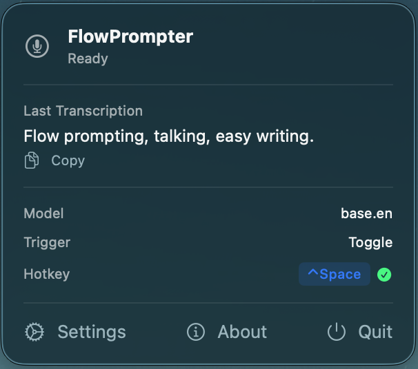
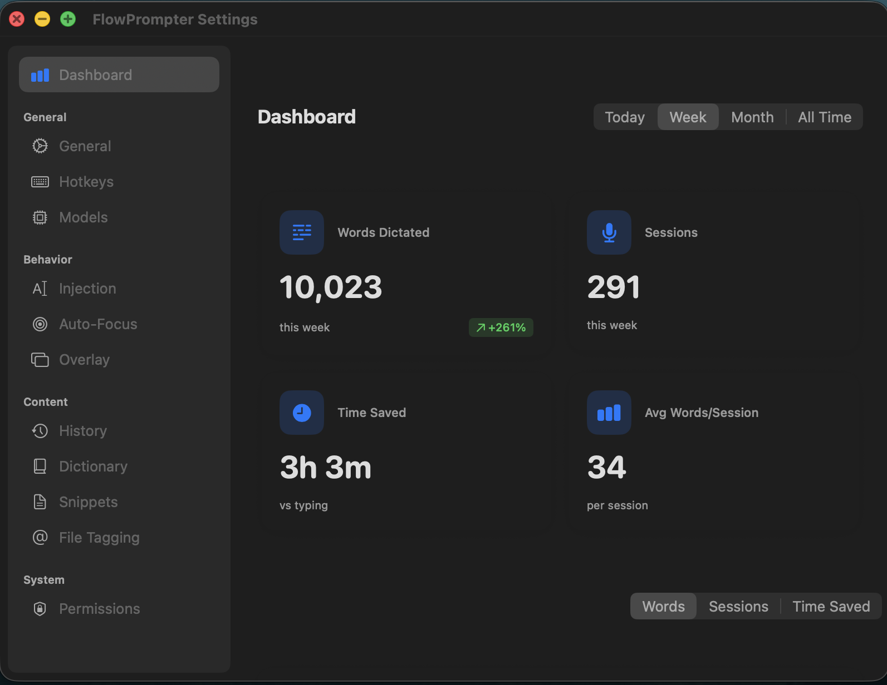

# Flow

A powerful macOS application that transforms your speech into intelligent, context-aware text for seamless integration with AI-powered development environments. Flow bridges the gap between voice dictation and modern IDEs, providing real-time transcription with advanced features like IDE file tagging, personal dictionaries, and syntax-aware dictation.



## 🎯 Key Features

### **Real-time Streaming Transcription**
- **Live Voice Processing**: Convert speech to text in real-time with low latency
- **Intelligent Punctuation**: Automatic capitalization and punctuation insertion
- **Noise Filtering**: Advanced audio processing to reduce background noise
- **Multi-language Support**: Support for various languages and accents

### **IDE Integration & File Tagging**
- **Smart File References**: Say "at app delegate swift" and get `@AppDelegate.swift`
- **Workspace Discovery**: Automatically scans your IDE workspace for available files
- **Fuzzy Matching**: Intelligent matching of spoken file names to actual files
- **Multi-IDE Support**: Works with Cursor, Windsurf, VS Code, Xcode, and JetBrains IDEs

### **Personal Dictionary & Customization**
- **Custom Vocabulary**: Add technical terms, acronyms, and project-specific words
- **Syntax Transformation**: Convert spoken programming syntax to proper code format
- **Context-Aware Suggestions**: AI-powered suggestions based on your coding context

### **Advanced Dictation Features**
- **Syntax-Aware Dictation**: Speak code naturally and get properly formatted syntax
- **Snippet Library**: Store and insert frequently used code snippets via voice
- **Usage Dashboard**: Track your dictation patterns and productivity metrics



## 🚀 Quick Start

### Prerequisites
- macOS 12.0 or later
- Xcode 14.0 or later (for development)
- Microphone access permissions

### Installation

#### From Source
1. Clone the repository:
   ```bash
   git clone https://github.com/artembatutin/flow.git
   cd flow
   ```

2. Open the project in Xcode:
   ```bash
   open Flow.xcodeproj
   ```

3. Build and run the project (⌘+R)

#### From Release
Download the latest signed DMG file from the [Releases](https://github.com/artembatutin/flow/releases) section.

## 📖 Documentation

Flow includes comprehensive documentation for all its features:

- **[IDE File Tagging](docs/ide-file-tagging.md)** - Learn how to reference files in your IDE using voice commands
- **[Personal Dictionary](docs/personal-dictionary.md)** - Customize vocabulary and transformations
- **[Real-time Streaming Transcription](docs/real-time-streaming-transcription.md)** - Understand the transcription pipeline
- **[Syntax-Aware Dictation](docs/syntax-aware-dictation.md)** - Speak code naturally with proper formatting
- **[Snippets Library](docs/snippets-library.md)** - Manage and use code snippets via voice
- **[Usage Dashboard](docs/usage-dashboard.md)** - Track productivity and usage patterns

## 🏗️ Architecture

Flow is built with a clean, modular architecture:

```
Flow/
├── Application/          # App lifecycle and dependency management
├── Domain/              # Business logic and models
├── Infrastructure/      # External integrations and services
├── Presentation/        # UI components and views
└── FlowApp.swift # Main app entry point
```

### Core Components

- **AudioEngine**: Handles real-time audio capture and processing
- **SpeechRecognizer**: Manages speech-to-text conversion
- **TextInjectionService**: Injects transcribed text into active applications
- **WorkspaceScanner**: Discovers and monitors IDE workspaces
- **FileTagger**: Converts spoken file references to proper tags
- **SettingsStore**: Manages user preferences and configuration

## 🔧 Configuration

Flow offers extensive customization through its settings interface:

- **Audio Settings**: Microphone selection, noise reduction, sensitivity
- **Transcription Settings**: Language, punctuation, formatting options
- **IDE Integration**: Workspace scanning, file matching preferences
- **Personal Dictionary**: Custom words, transformations, snippets
- **Advanced Options**: Performance tuning, debug logging

## 🛠️ Development

### Building from Source

1. **Clone the repository**
   ```bash
   git clone https://github.com/artembatutin/flow.git
   cd flow
   ```

2. **Install dependencies**
   ```bash
   # Swift Package Manager dependencies are automatically resolved
   ```

3. **Open in Xcode**
   ```bash
   open Flow.xcodeproj
   ```

4. **Build and run in Xcode**
   - Select a target device/simulator
   - Press ⌘+R to build and run

5. **Or build from Terminal**
   ```bash
   make build
   make install
   ```

6. **Clean local build output**
   ```bash
   make clean
   ```

### Running Tests

```bash
# Run unit tests
xcodebuild test -project Flow.xcodeproj -scheme FlowTests -destination 'platform=macOS'
```

### Contributing

We welcome issues and pull requests through GitHub.

## 🐛 Troubleshooting

### Common Issues

**Microphone Permission Denied**
- Go to System Preferences → Security & Privacy → Privacy → Microphone
- Enable Flow in the microphone access list

**IDE Integration Not Working**
- Ensure your IDE is supported (Cursor, Windsurf, VS Code, Xcode, JetBrains)
- Check that accessibility permissions are enabled for Flow
- Verify workspace scanning is enabled in settings

**Speech Recognition Accuracy**
- Check microphone quality and positioning
- Adjust noise reduction settings
- Add custom vocabulary to personal dictionary

**Performance Issues**
- Reduce audio quality settings if needed
- Disable unnecessary features in settings
- Check system resource usage

### Getting Help

- **Documentation**: Check the `docs/` folder for detailed feature documentation
- **Issues**: Report bugs and request features on the [GitHub Issues](https://github.com/artembatutin/flow/issues) page
- **Discussions**: Join community discussions in the [GitHub Discussions](https://github.com/artembatutin/flow/discussions) section

## 📄 License

This project is licensed under the MIT License - see the [LICENSE](LICENSE) file for details.

## 🙏 Acknowledgments

- Apple Speech Framework for speech recognition capabilities
- SwiftUI community for UI components and inspiration
- Open source contributors who make projects like this possible

## 📊 Roadmap

- **Enhanced AI Integration**: Improved context-aware suggestions
- **Multi-language Support**: Expanded language recognition
- **Team Collaboration**: Shared dictionaries and configurations
- **Plugin Architecture**: Extensible plugin system for custom integrations
- **Cross-platform Support**: Windows and Linux versions

---

**Made with ❤️ for the developer community**

For questions, support, or to contribute, please visit the [GitHub repository](https://github.com/artembatutin/flow).
